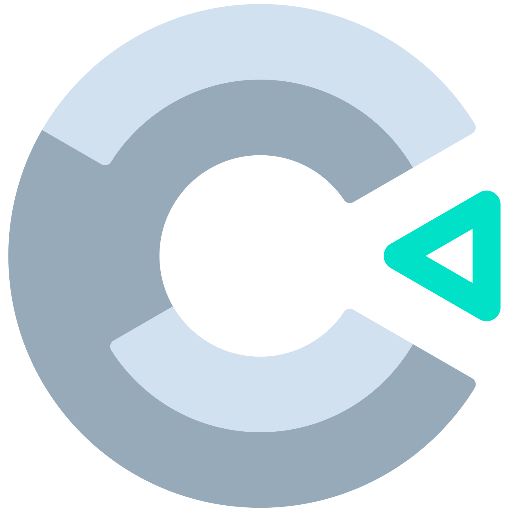

 

  

  <h3 align="center" >It is my Construct CV</h3>

    
  

## Introduction 
Hi my name is Daniil, I am a developer specializing in different technologies, one of them is  Construct 2. I worked for Construct 2 Mentor for 4 years and here I will show you several of my projects.

## Important
Many of my projects are not my private property, I have sold them, that is why in this repo you will see not one game from tutorial or official Construct documentation, however I upgraded functionality for these projects. 

## Stack of technologies
* [![Construct][Construct]][Construct-url]
* [![JavaScript][JavaScript]][JavaScript-url]
* [![NodeJs][NodeJs]][NodeJs-url]

## Levels
After each game I wrote the difficulty level of creation  
$\color{#55AE5B}{{Easy}}$ - Easy mechanics, elementary behaviors are used, logic is simple, components are not complex 
$\color{#E3C678}{{Medium}}$ - Loops, behaviors are written manually, animations are linked to events, several complex components can be used 
$\color{#FF0000}{{Hard}}$ - Different ways to use storages, browsers etc, work with JS, interaction animation is must have, more that 10 layouts

## Games
### Run or die - $\color{#55AE5B}{{Easy}}$ 
#### A basic platformer with interesting traps and animations, there is also an enemy that will follow you. 

### Space shooter - $\color{#E3C678}{{Medium}}$
#### Shooter with The Boss and enemies, The Boss has different modes and that is why he is dangerous. A lot of things was upgraded
 
#### This code was optimized, in tutorial it was awful  
 
#### What was in the tutorial: 
 
#### This code is terrible ... The guy propose to use separate objects to interact with HP meteor, instead of it I used the loop

### The water is coming - $\color{#55AE5B}{{Easy}}$ 
#### Your diamond is very sensitive to water and may be destroyed from it, that is why you have to run away from the water

### Knife Hit - $\color{#E3C678}{{Medium}}$
#### A very popular game, It has a lot of tutorials however without animation with apple and knife falling, in my game I have implemented these functionalities, and downloaded sprites from the original game.

### Bunny Jumper - $\color{#E3C678}{{Medium}}$
#### Doodle jump but with bunny. 

### Dino Chorome - $\color{#55AE5B}{{Easy}}$ 
#### Enemies and traps threaten you, you must avoid them

### Space walk - $\color{#55AE5B}{{Easy}}$
#### Your player loves space, but meteorites prevent them from enjoying it

### $\color{#FF0000}{{Hard}}$. Usually complex games are commercial projects and I can't show them here

[Construct]: https://img.shields.io/badge/construct2-2A7BA0?style=for-the-badge&logo=construct3&logoColor=white
[Construct-url]: https://spring.io/projects/spring-framework

[JavaScript]: https://img.shields.io/badge/javascript-F7DF1E?style=for-the-badge&logo=javascript&logoColor=white
[JavaScript-url]: https://spring.io/projects/spring-framework

[NodeJs]: https://img.shields.io/badge/nodejs-339933?style=for-the-badge&logo=nodedotjs&logoColor=white
[NodeJs-url]: https://spring.io/projects/spring-framework
